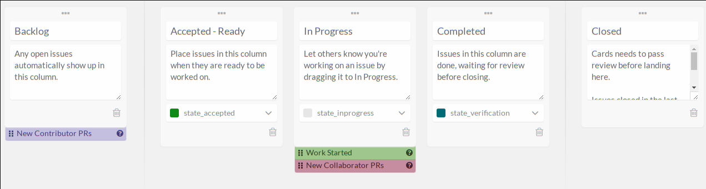

## visualize

- use https://waffle.io/ to visualize this agile methodology 
- this gives you a Kanban method on top of all your stories/bugs/fr's/tickets/...

### How to use Waffles
Waffle present the issues and pull requests from one or more Github repository.
We use 5 columns to categorize our works.  

- **Backlog**: It's in this column that newly created issues or issues that don't have a type lives.
- **Accepted-Ready**: In this column we find the issue that are ready to be work on. No code should have been written for an issue before it reach this column.
- **In progress**: When someone is working on a task, the task is known as in progress. By looking at that column we can track on what the team is focusing on at the moment.